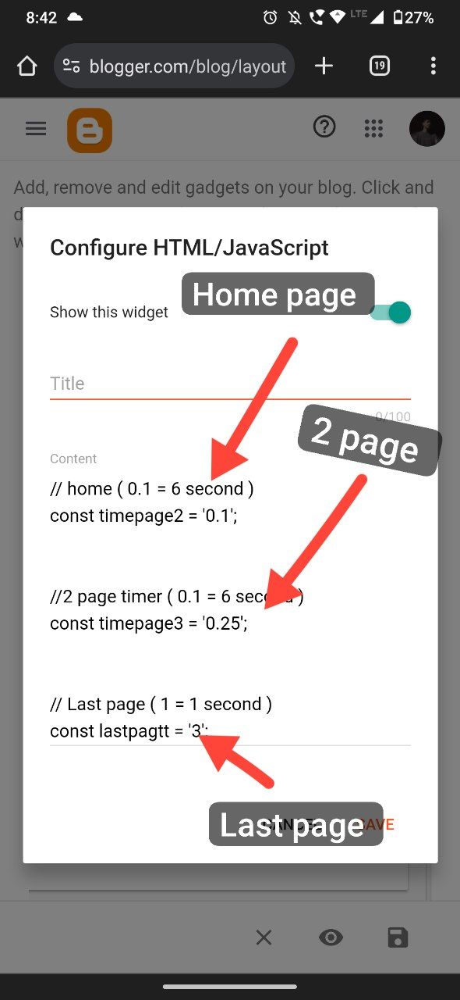
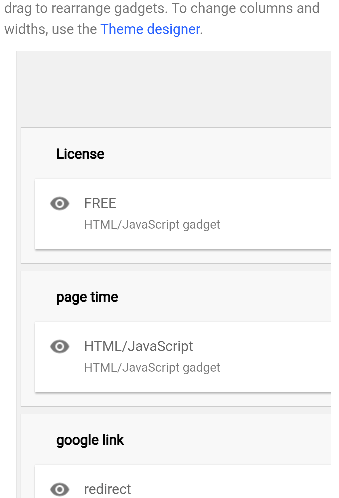

<h1>blogger wplikely safe version 1.2 update </h1>

  

 Easy change time&nbsp; <h2 style="text-align: left;">How to change time&nbsp;</h2>

  
// home ( <u>0.1 = 6 second</u> )

  
const timepage2 = '<b style="background-color: #fcff01;">0.1</b>';

  
 

  
 

  
//2 page timer ( <u>0.1 = 6 second</u> )

  

    const timepage3 = '<b>0.25</b>';
  

  
 

  
 

  
// Last page ( <u>1 = 1 second</u> )

  

    const lastpagtt = '<b>3</b>';
  

 

